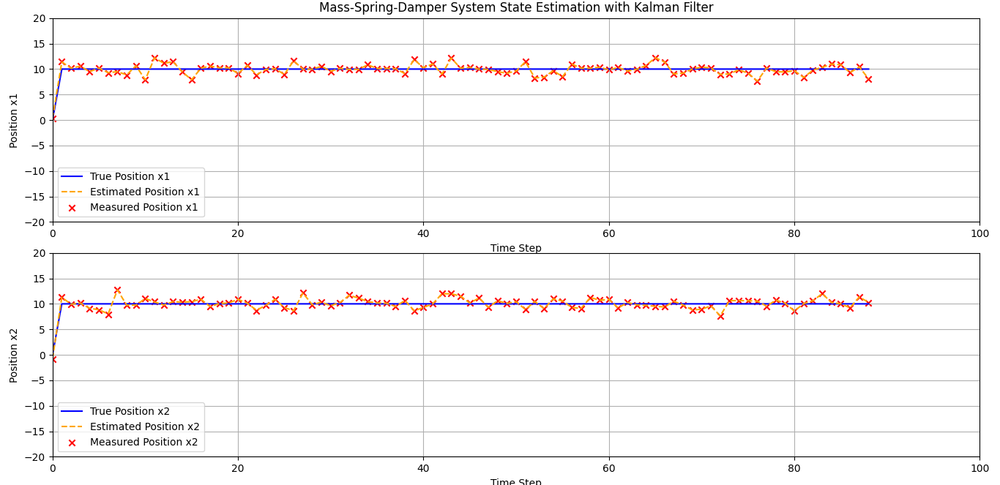

# 🏃‍♂️ The Smart Guessing Game for Moving Things!

## 🤔 What is This Cool Project?

Hi there, young scientist! 👋 

Imagine you have a **bouncy ball** attached to a **spring** (like a slinky), and you want to know exactly where it is at any moment. But here's the problem: your eyes aren't perfect, and sometimes you can't see the ball clearly because of fog or darkness! 🌫️

This project is like having **super smart glasses** that help you guess where the ball really is, even when you can't see it perfectly. These "smart glasses" are called a **Kalman Filter** - think of it as a really good guesser that gets better and better at guessing! 🤓

## 🎯 What Does This Do?

This project shows you how a computer can be really smart at guessing where moving things are, just like how you might guess where a friend is hiding by listening to their footsteps! 👂

### 🎪 The Magic Show Features:

- 🎮 **Interactive Fun**: Watch colorful moving graphs that show the real position, what we can "see" (with mistakes), and what our smart guesser thinks!
- 🎛️ **You're the Boss**: Change how heavy the ball is, how bouncy the spring is, and how much the ball wiggles!
- 🔍 **Smart Checker**: Makes sure our system can actually be watched and understood before starting
- 📊 **Pretty Pictures**: See beautiful charts that show how well our smart guesser is working!

## 🚀 What Can You See?

The project creates amazing charts with three different colored lines:
- 🔵 **Blue Line**: This is where the ball REALLY is (the truth!)
- 🟠 **Orange Dashed Line**: This is where our smart guesser THINKS the ball is
- ❌ **Red X's**: These are our "noisy" measurements - what we can see, but with mistakes

## 🎭 Real-Life Examples

This smart guessing technology is used in:
- 🚗 **Self-driving cars** - to know where they are on the road
- 📱 **Your phone's GPS** - to find your location even when the signal is weak  
- 🚀 **Rockets and satellites** - to stay on course in space
- 🎮 **Video games** - to track where players are moving

## 🧠 How Does It Work? (The Simple Version)

Think of it like this:
1. 👀 You take a quick peek at where you think the ball is (but you might be wrong)
2. 🧮 The computer uses math to make a really good guess
3. ⏰ Time passes and the ball moves
4. 👀 You take another peek
5. 🤖 The computer combines your peek with its smart math to make an even BETTER guess
6. 🔄 Repeat this over and over, getting smarter each time!

It's like playing a guessing game where you get better and better at guessing by combining what you see with what you know about how things move! 🎯

## 🎨 What You'll See

Below is an example of the cool graphs this project makes:

Look at how the orange dashed line (our smart guess) stays close to the blue line (the real truth), even though the red X's (what we can see) are all scattered around! That's the magic of smart guessing! ✨

## 🌟 Why Is This Amazing?

This project teaches us that:
- 🤖 Computers can be really smart at guessing
- 📈 Math can help us understand messy, noisy information  
- 🎯 We can make better guesses by combining what we see with what we know
- 🔬 Science and math can solve real-world problems in fun ways!

## 🎓 What You'll Learn

By exploring this project, you'll discover:
- How to make smart guesses about moving things
- Why combining information makes us smarter
- How computers help solve tricky problems
- The basics of prediction and estimation (fancy words for "smart guessing"!)

Remember: Even the most advanced rockets and cars use the same basic idea - smart guessing based on what they can see and what they know! 🚀✨

---

*Made with ❤️ for curious young minds who want to understand how the world works!*

